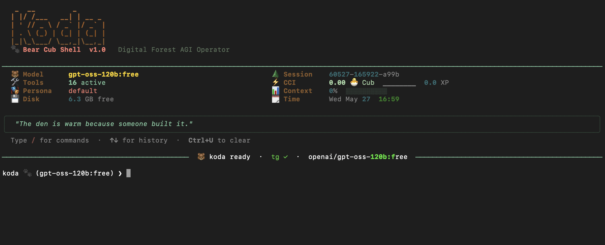

<p align="center">
  
</p>

<h1 align="center">Koda 🐻</h1>

<p align="center">
  <strong>A personal AI agent that lives on your computer and actually gets things done.</strong><br/>
  Terminal-based · Works on Mac and Windows · Free to start
</p>

<p align="center">
  <a href="#install">Install</a> ·
  <a href="#what-it-does">What it does</a> ·
  <a href="#setup">Setup</a> ·
  <a href="#obsidian-brain-view">Obsidian brain view</a> ·
  <a href="#requirements">Requirements</a>
</p>

---

## What it does

Koda is not a chatbot. It's an agent — it has memory, runs automations on a schedule, reads your files and email, and shows up with context every time you open it.

| Capability | Details |
|---|---|
| 💬 **Conversation** | Remembers your preferences and past context across sessions |
| 📅 **Scheduler** | Set up recurring automations — morning briefs, inbox triage, weekly reviews |
| 📧 **Email triage** | Reads your Outlook or Gmail inbox, surfaces what needs attention |
| 📄 **Office files** | Reads and writes Word docs, Excel spreadsheets, and PDFs |
| 📱 **Telegram delivery** | Get automation results sent to your phone |
| 🛠️ **Shell + files** | Full access to your local filesystem and terminal |
| 🍎 **macOS extras** | iMessages, Reminders, Calendar, Notes, Contacts |
| 🧠 **Obsidian brain** | Visual graph of everything Koda knows, updating live |
| 🏆 **CCI leaderboard** | Tracks quality growth over time, post your score publicly |

---

## Install

### macOS

```bash
bash <(curl -sSL https://raw.githubusercontent.com/jordanheckler-HMM/koda-agent/main/install.sh)
```

### Windows

**Step 1 — Open PowerShell and install WSL** (skip if you already have WSL)

Search "PowerShell" in the Start menu, open it, and run:

```powershell
wsl --install
```

When it finishes, **restart your computer**.

**Step 2 — Open the Ubuntu app (not PowerShell)**

After restarting, search **"Ubuntu"** in the Start menu and open it. It's a different app — black terminal window with a `$` prompt.

> ⚠️ The next command will not work in PowerShell. It must be run inside Ubuntu.

**Step 3 — Install Koda** (run this inside Ubuntu)

```bash
bash <(curl -sSL https://raw.githubusercontent.com/jordanheckler-HMM/koda-agent/main/install.sh)
```

The installer handles Python, dependencies, and PATH automatically.

> Every time you want to run Koda, open **Ubuntu** from the Start menu and type `koda`.

---

## Setup

The setup wizard runs automatically after install. You need two things:

### 1. Your name
Koda uses it in conversations and automations.

### 2. A free OpenRouter API key
OpenRouter is how Koda connects to AI models. The free tier requires no credit card.

1. Go to [openrouter.ai/keys](https://openrouter.ai/keys)
2. Sign up — takes about a minute
3. Click **Create Key** and paste it into the wizard

### Optional: Email, Telegram, Obsidian
The wizard will ask about these. All optional — skip anything you don't need and add it later.

To re-run setup at any time:
```bash
koda setup
```

---

## Automations

Ask Koda what's available and it'll show you a list of built-in options to install:

```
> What automations can I set up?
```

Built-in templates include morning briefs, inbox triage, weekly reviews, daily focus, and reminders checks. Nothing runs automatically — you choose what to install and how it gets delivered.

You can also ask for anything custom:

```
> Remind me every weekday at 9am to check my pipeline
> Send me a summary of my Excel report every Monday morning
```

---

## Custom skills

Koda can build slash commands for itself:

```
> Create a /focus skill that helps me pick the one most important thing to work on today
```

Type `/focus` in the terminal to run it anytime.

---

## Personalizing Koda

Koda learns your preferences as you use it. You can also be explicit:

```
> Always be brief with me
> I prefer bullet points over paragraphs
```

Edit `~/.koda/Soul.md` to change Koda's personality at a deeper level — or leave it as-is.

---

## Obsidian brain view

[Obsidian](https://obsidian.md) is a free note app with a graph view that shows how your notes connect. Link it to Koda and get a live visual map of everything Koda knows — sessions, automations, learned preferences, and progress.

**Setup:**

1. Download Obsidian at [obsidian.md](https://obsidian.md) — free, works on Mac and Windows
2. Create a new vault (or use an existing one)
3. Add one line to `~/.koda/.env`:

```env
OBSIDIAN_VAULT=/path/to/your/vault
```

- **Mac:** `/Users/yourname/Documents/MyVault`
- **Windows (WSL):** `/mnt/c/Users/yourname/Documents/MyVault`

Restart Koda — it creates a `Koda/` folder in your vault and keeps it updated automatically.

---

## Keeping Koda updated

```bash
koda update
```

---

## Requirements

- **macOS** 12+ or **Windows 10/11** with WSL
- A free [OpenRouter](https://openrouter.ai) account

The installer handles Python, pip, and everything else.

---

## License

MIT
